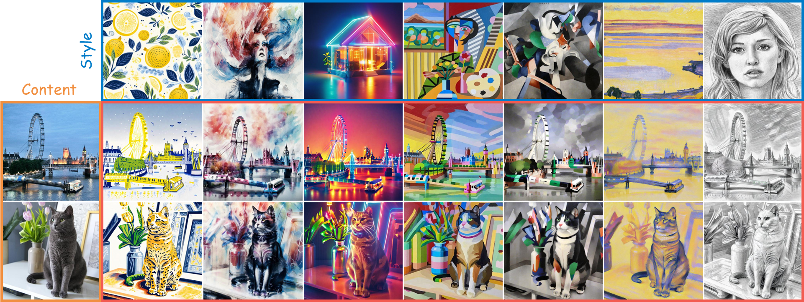
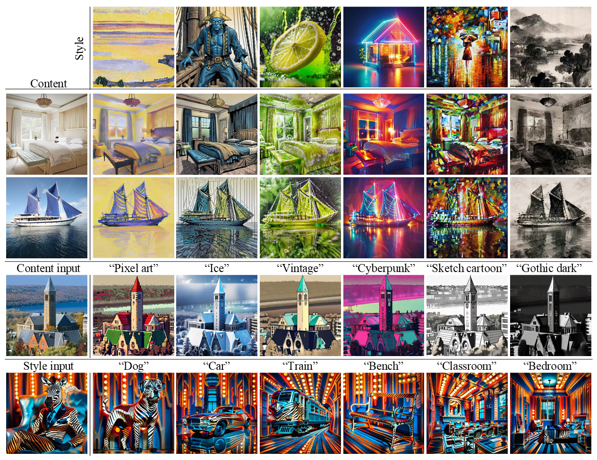

# ConsisLoRA: Enhancing Content and Style Consistency for LoRA-based Style Transfer

<a href='https://ConsisLoRA.github.io/'></a>
<a href='https://arxiv.org/abs/2503.10614'></a>

This repository contains the reference source code for the paper 
[ConsisLoRA: Enhancing Content and Style Consistency for LoRA-based Style Transfer](https://arxiv.org/pdf/2503.10614).




## 🔥 News
- **2025/03/24**: We release the inference code and LoRA checkpoints (see [here](https://huggingface.co/chenblin26)). 

## ⏳ TODOs
- [x] Release the inference code.
- [ ] Release the training code.

## Getting Started
This code was tested with Python 3.11, Pytorch 2.1 and Diffusers 0.31.
### Installation
```bash
git clone https://github.com/000linlin/ConsisLoRA.git
cd consislora

conda create -n consislora python=3.11
conda activate consislora

pip install -r requirements.txt
```

### 1. Train ConsisLoRA for content and style image
Waiting for training code release.

### 2. Inference
- For style transfer, run:
```
python inference.py \
    --prompt "a [c] in the style of [v]" \
    --content_image_lora_path "path/to/content" \
    --style_image_lora_path "path/to/style" \
    --lora_scaling 1. 1. \
    --guidance_scale 7.5 \
    --output_dir "inference-images" \
    --num_images_per_prompt 1 \
    --num_steps 30 
```
Note that some additional parameters can be set for two guidance (see [Section 4.3](https://arxiv.org/pdf/2503.10614) of our paper).
1. `--content_guidance_scale`, `--style_guidance_scale` for controlling the strength of two guidance. Turning on the guidance will increase the inference time.
2. `--add_positive_content_prompt`, `--add_negative_content_prompt` is positive and negative prompts for content guidance, respectively. e.g, you can set `a [c]` and `a [v]` for them.
3. `--add_positive_style_prompt`, `--add_negative_style_prompt` is positive and negative prompts for style guidance, respectively. e.g, you can set `in the style of [v]` and `in the style of [c]` for them.

- For using the content LoRA separately, run:
```
python inference.py \
    --prompt "a [c] in pixel art style" \
    --content_image_lora_path "path/to/content" \
    --lora_scaling 1. 0.
```

- For using the style LoRA separately, run:
```
python inference.py \
    --prompt "a dog in the style of [v]" \
    --style_image_lora_path "path/to/style" \
    --lora_scaling 0. 1.
```

See the [**inference_demo**][inference] notebook for more details on how to generate stylized images.

## Demos
For more results, please visit our <a href="https://ConsisLoRA.github.io/"><strong>Project page</strong></a>. 



## Acknowledgements
Our code mainly bases on [B-LoRA](https://github.com/yardenfren1996/B-LoRA) and [diffusers](https://github.com/huggingface/diffusers/blob/main/examples/dreambooth/train_dreambooth_lora_sdxl.py). A huge thank you to the authors for their valuable contributions.

## Citation
If you use this code, please consider citing our paper:
```bibtex
@article{chen2025consislora,
        title={ConsisLoRA: Enhancing Content and Style Consistency for LoRA-based Style Transfer},
        author={Bolin Chen, Baoquan Zhao, Haoran Xie, Yi Cai, Qing Li and Xudong Mao},
        journal={arXiv preprint arXiv:2503.10614},
        year={2025}
} 
```

[inference]: inference_demo.ipynb